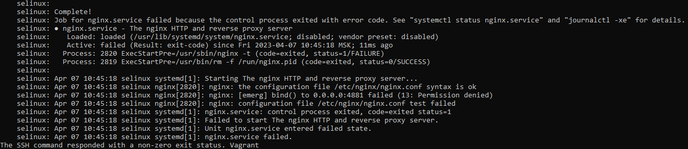
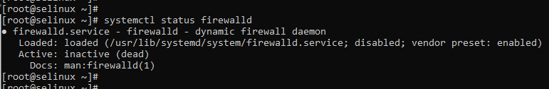
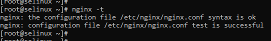
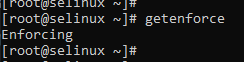

<p>Перед выполнением работы в Vagrantfile прописал смену времени на московское b установку policycoreutils-python:</p>

```bash
cp -f /usr/share/zoneinfo/Europe/Moscow /etc/localtime
yum install -y policycoreutils-python

```

<h1 align="center">Запустить nginx на нестандартном порту 3-мя разными способами:</h1>

<h2 align="left">Способ с переключателями setsebool</h2>
<p>Во время развёртывания стенда попытка запустить nginx завершилась с ошибкой<br>


файервол отключен<br>


конфигурация nginx настроена без ошибок<br>


режим работы SELinux – Enforcing<br>



</p>
  добавление нестандартного порта в имеющийся тип;
  формирование и установка модуля SELinux.

К сдаче:
  README с описанием каждого решения (скриншоты и демонстрация приветствуются).


2 Обеспечить работоспособность приложения при включенном selinux.
  развернуть приложенный стенд https://github.com/mbfx/otus-linux-adm/tree/master/selinux_dns_problems;
  выяснить причину неработоспособности механизма обновления зоны (см. README);
  предложить решение (или решения) для данной проблемы;
  выбрать одно из решений для реализации, предварительно обосновав выбор;
  реализовать выбранное решение и продемонстрировать его работоспособность.

К сдаче:
  README с анализом причины неработоспособности, возможными способами решения и обоснованием выбора одного из них;
  исправленный стенд или демонстрация работоспособной системы скриншотами и описанием.