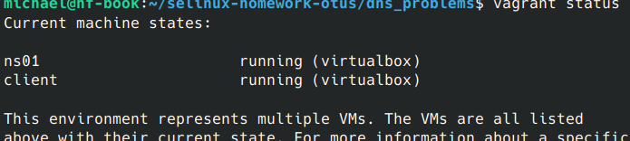
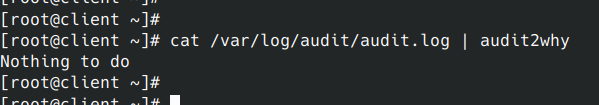
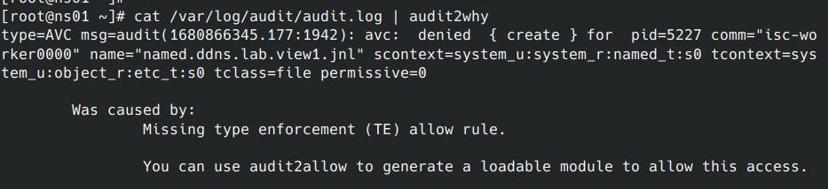
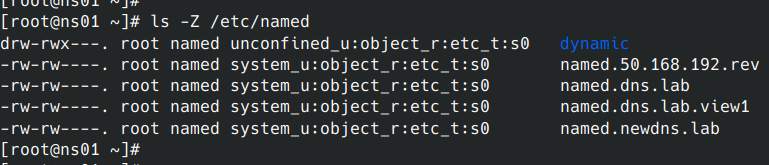
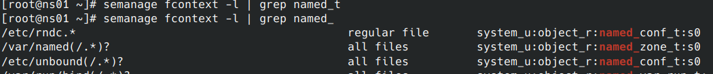
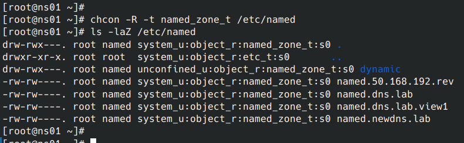
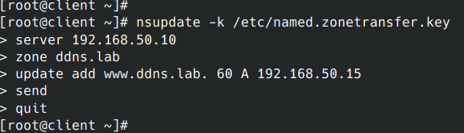
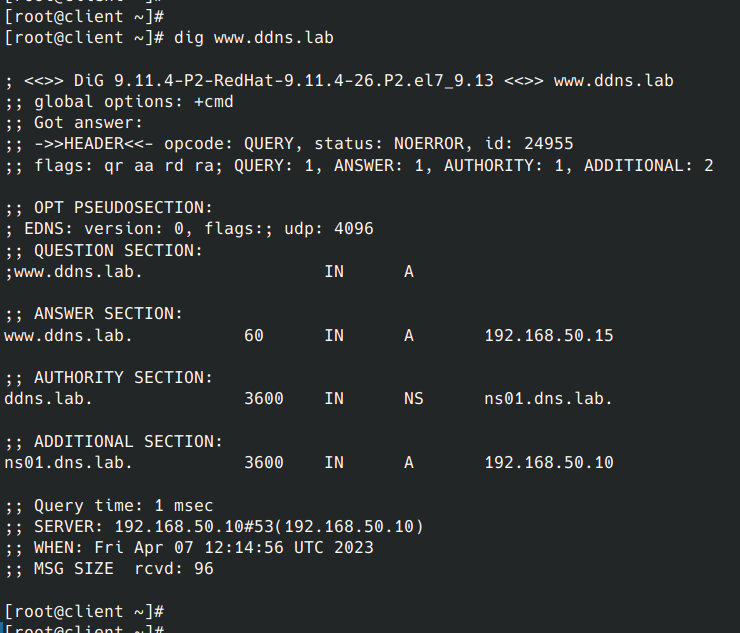
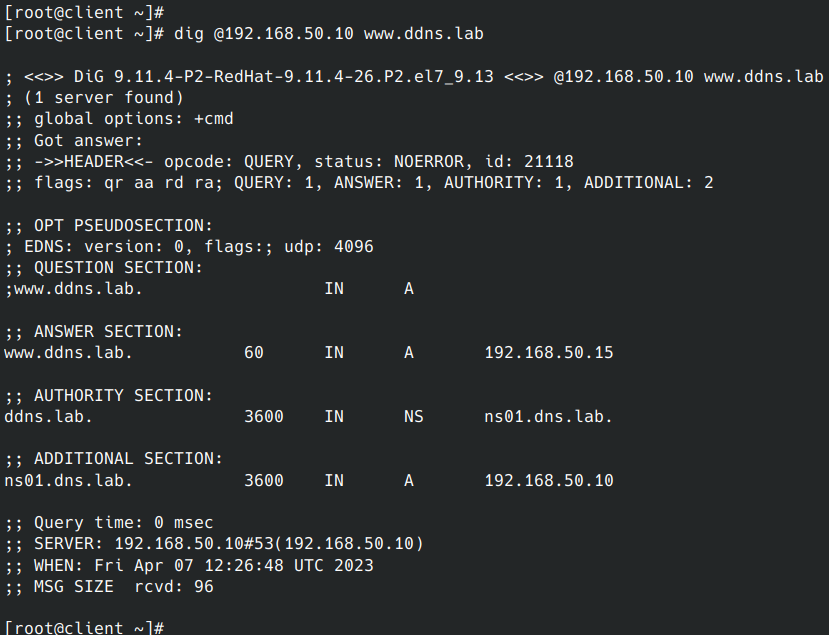
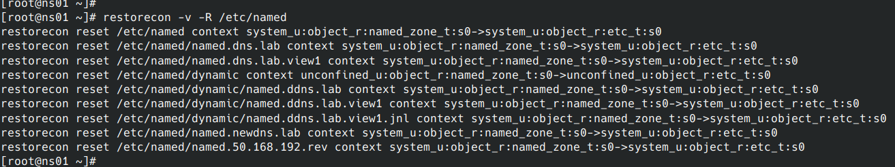

<h1 align="center">Обеспечение работоспособности приложения при включенном SELinux</h1>
<p>
#### SELinux: проблема с удаленным обновлением зоны DNS

Инженер настроил следующую схему:

- ns01 - DNS-сервер (192.168.50.10);
- client - клиентская рабочая станция (192.168.50.15).

При попытке удаленно (с рабочей станции) внести изменения в зону ddns.lab происходит следующее:
```bash
[vagrant@client ~]$ nsupdate -k /etc/named.zonetransfer.key
> server 192.168.50.10
> zone ddns.lab
> update add www.ddns.lab. 60 A 192.168.50.15
> send
update failed: SERVFAIL
>
```
Инженер перепроверил содержимое конфигурационных файлов и, убедившись, что с ними всё в порядке, предположил, что данная ошибка связана с SELinux.

В данной работе предлагается разобраться с возникшей ситуацией.
</p>
<br>
<br>
<br>
<br>
<p>
развернул приложенный стенд https://github.com/mbfx/otus-linux-adm/tree/master/selinux_dns_problems<br>

чищу лог аудита
echo > /var/log/audit/audit.log


На клиентской машине пробую внести изменения в зону:<br>

```bash
nsupdate -k /etc/named.zonetransfer.key
```


Изменения внести не получилось.<br>

Смотрю логи SELinux, чтобы понять в чем может быть проблема.<br>

```bash
cat /var/log/audit/audit.log | audit2why
```

Ошибок на клиенте нет.<br>



Не закрывая сессию на клиенте, подключаюсь к серверу ns01
проверяю лог там


```bash
cat /var/log/audit/audit.log | audit2why
```



В логах вижу, что ошибка в контексте безопасности.<br>
Вместо типа named_t используется тип etc_t.<br>

проверяю данную проблему в каталоге /etc/named<br>

```bash
ls -Z /etc/named
```



смотрю каталоги с подходящими политиками

```bash
sudo semanage fcontext -l | grep named
```



```bash
chcon -R -t named_zone_t /etc/named
ls -laZ /etc/named
```



снова вношу изменения с клиента

```bash
nsupdate -k /etc/named.zonetransfer.key
> server 192.168.50.10
> zone ddns.lab
> update add www.ddns.lab. 60 A 192.168.50.15
> send
> quit
```




[root@client ~]# dig www.ddns.lab



перезагружаю хосты
показываются те же самые настройки
[root@client ~]# dig @192.168.50.10 www.ddns.lab


Возвращаю правила обратно

```bash
[root@ns01 ~]# restorecon -v -R /etc/named
```



