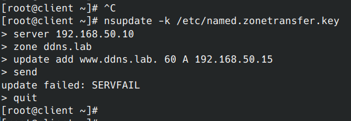

<h1 align="center">Обеспечение работоспособности приложения при включенном SELinux</h1>

<h2 align="left">Способ с переключателями setsebool</h2>
<p>
развернуть приложенный стенд https://github.com/mbfx/otus-linux-adm/tree/master/selinux_dns_problems<br>

чищу лог аудита
echo > /var/log/audit/audit.log


На клиентской машине попробуем внести изменения в зону:<br>

```bash
nsupdate -k /etc/named.zonetransfer.key
```



Изменения внести не получилось.<br>

Смотрим логи SELinux, чтобы понять в чем может быть проблема.<br>

```bash
cat /var/log/audit/audit.log | audit2why
```

Ошибок на клиенте нет.<br>


Не закрывая сессию на клиенте, подключаюсь к серверу ns01
проверяю лог там


```bash
cat /var/log/audit/audit.log | audit2why
```


В логах мы видим, что ошибка в контексте безопасности.<br>
Вместо типа named_t используется тип etc_t.<br>

проверим данную проблему в каталоге /etc/named<br>

```bash
ls -Z /etc/named
```


посмотреть каталоги с подходящими политиками
sudo semanage fcontext -l | grep named


chcon -R -t named_zone_t /etc/named
ls -laZ /etc/named


снова вносим изменения с клиента
nsupdate -k /etc/named.zonetransfer.key
> server 192.168.50.10
> zone ddns.lab
> update add www.ddns.lab. 60 A 192.168.50.15
> send
> quit


[root@client ~]# dig www.ddns.lab


перезагружаю хосты
команда из методички показывает те же самые настройки
[root@client ~]# dig @192.168.50.10 www.ddns.lab


старая же команда показывает другие
[root@client ~]# dig www.ddns.lab


[root@ns01 ~]# restorecon -v -R /etc/named


Обеспечить работоспособность приложения при включенном selinux.
развернуть приложенный стенд https://github.com/mbfx/otus-linux-adm/tree/master/selinux_dns_problems;
выяснить причину неработоспособности механизма обновления зоны (см. README);
предложить решение (или решения) для данной проблемы;
выбрать одно из решений для реализации, предварительно обосновав выбор;
реализовать выбранное решение и продемонстрировать его работоспособность.
К сдаче:
README с анализом причины неработоспособности, возможными способами решения и обоснованием выбора одного из них;
исправленный стенд или демонстрация работоспособной системы скриншотами и описанием.