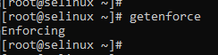

<p>Перед выполнением работы в Vagrantfile прописал смену времени на московское и установку policycoreutils-python:</p>

```bash
cp -f /usr/share/zoneinfo/Europe/Moscow /etc/localtime
yum install -y policycoreutils-python

```

<h1 align="center">Запустить nginx на нестандартном порту 3-мя разными способами:</h1>

<h2 align="left">Способ с переключателями setsebool</h2>
<p>
Во время развёртывания стенда попытка запустить nginx завершилась с ошибкой<br>


файервол отключен<br>


конфигурация nginx настроена без ошибок<br>


режим работы SELinux – Enforcing<br>


сконвертировал отметку времени из лога в Unix Timestamp
на сайте https://www.unixtimestamp.com/<br>


смотрю лог аудита утилитой audit2why<br>


после предложенного утилитой изменения параметра nginx запустился<br>


проверка измененного параметра<br>

```bash
getsebool -a | grep nis_enabled
```

</p>

<h2 align="left">способ с добавлением нестандартного порта в имеющийся тип</h2>
<p>
ищу имеющийся тип для http трафика<br>

```bash
semanage port -l | grep http
```


добавил порт в тип http_port_t<br>

```bash
semanage port -a -t http_port_t -p tcp 4881
```


Nginx запустился в работает<br>
После удаления порта из типа — не работает<br>

```bash
semanage port -d -t http_port_t -p tcp 4881
```

</p>

<h2 align="left">Способ с формированием и установкой модуля SELinux</h2>
<p>
nginx на нестандартном  порту TCP 4881 - не запускается<br>


смотрю логи аудита относящиеся к nginx<br>

```bash
grep nginx /var/log/audit/audit.log
```


Использую утилиту audit2allow для того, чтобы на основе логов SELinux сделать модуль, разрешающий работу nginx на нестандартном порту:<br>

```bash
grep nginx /var/log/audit/audit.log | audit2allow -M nginx
```
Audit2allow сформировал модуль, и сообщил нам команду, с помощью которой можно применить данный модуль<br>


```bash
semodule -i nginx.pp
```


После добавления модуля nginx запустился без ошибок<br>
При использовании модуля изменения сохранятся после перезагрузки<br>
<br>
Просмотр всех установленных модулей:

```bash
semodule -l
```


Для удаления модуля воспользуемся командой

```bash
semodule -r nginx
```


</p>
